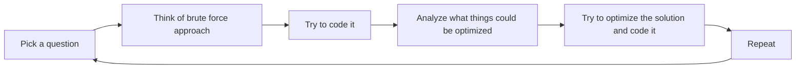

# About 450-DSA
*It contains a collection of 450 questions of Data Structures and Algorithms in C++.*

##Credits

[Love Babbar](https://www.youtube.com/watch?v=4iFALQ1ACdA)

##Ideal Approach to solve the problems :

